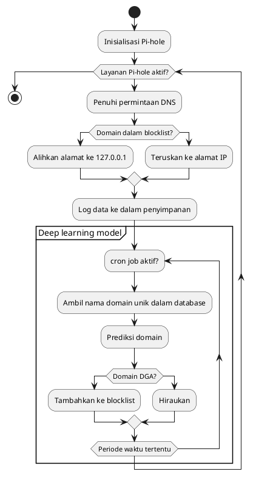
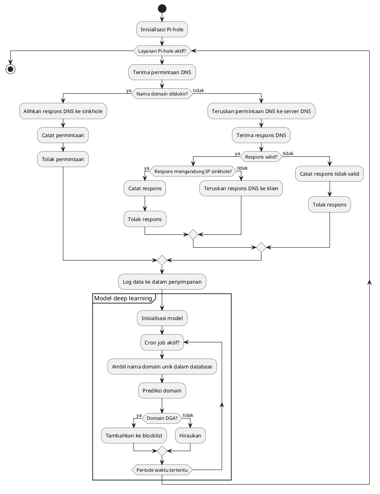
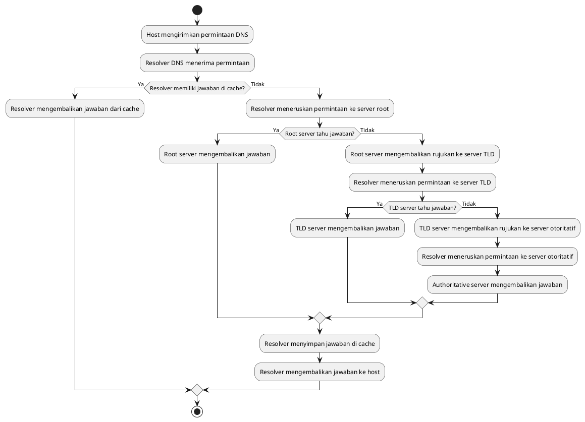

# Activity UML

This activity diagram illustrates the workflow of a Pi-hole system, which is used to block unwanted DNS queries. The diagram shows the main activities involved in the Pi-hole process.

1. The system starts by initializing Pi-hole.
2. While the Pi-hole service is active, it receives DNS queries.
3. If the domain is found in the blocklist, the address is redirected to 127.0.0.1, indicating a blocked domain.
4. If the domain is not in the blocklist, the DNS query is forwarded to the corresponding IP address.
5. The system logs the DNS data for further analysis and monitoring.
6. Within the "Deep learning model" group, a cron job periodically activates.
7. The system retrieves unique domain names from the database.
8. The domain names are passed to a prediction model to determine if they are generated using Domain Generation Algorithms (DGA).
9. If a domain is classified as DGA-generated, it is added to the blocklist to prevent future queries.
10. If a domain is not classified as DGA-generated, it is ignored.
11. The process repeats at regular intervals.
12. This diagram provides an overview of the Pi-hole system's core activities, including DNS query handling and domain prediction using a deep learning model.

This diagram provides an overview of the Pi-hole system's core activities, including DNS query handling and domain prediction using a deep learning model.

# Comphrehensive diagram

This comprehensive diagram builds upon the previous activity diagram and provides a more detailed representation of the Pi-hole system's functionality.

1. The system starts by initializing Pi-hole.
2. While the Pi-hole service is active, it receives DNS queries. If the domain name is found in the blocklist, indicating it is blocked, the DNS response is redirected to a sinkhole. The system records the DNS query, and the request is denied. If the domain name is not in the blocklist, the DNS query is forwarded to a DNS server.
5. The system receives the DNS response from the server.
6. If the response is valid, the system checks if it contains an IP address associated with a sinkhole. If it does, the response is recorded, and it is denied.
7. If the response does not contain a sinkhole IP address, it is forwarded to the client.
8. If the DNS response is not valid, the system records the invalid response and denies it.
9. The system logs the DNS data for further analysis and monitoring.
10. Within the "Model deep learning" group, the system initializes the deep learning model.
11. A cron job periodically activates to perform the following steps:
    - Retrieve unique domain names from the database.
    - Predict the nature of the domain (whether it is generated using Domain Generation Algorithms - DGA).
    - If the domain is classified as DGA-generated, it is added to the blocklist to prevent future queries.
    - If the domain is not classified as DGA-generated, it is ignored.
12. The process repeats at regular intervals.

This comprehensive diagram provides a detailed overview of the Pi-hole system's activities, including DNS query handling, sinkholing, DNS response validation, logging, and domain prediction using a deep learning model.

# DNS Query

This diagram illustrates the process of a DNS query, showing how a DNS resolver resolves a domain name into an IP address.

1. The process begins with the host sending a DNS query request.
2. The DNS resolver receives the request.
3. The resolver checks if it has the answer cached for the requested domain.
4. If the resolver has the answer in its cache, it returns the answer directly from the cache.
5. If the resolver does not have the answer in its cache, it forwards the request to a root server.
6. The root server checks if it has the answer.
7. If the root server has the answer, it returns the answer to the resolver.
8. If the root server does not have the answer, it returns a referral to a Top-Level Domain (TLD) server.
9. The resolver then forwards the request to the TLD server.
10. The TLD server checks if it has the answer.
11. If the TLD server has the answer, it returns the answer to the resolver.
12. If the TLD server does not have the answer, it returns a referral to an authoritative server.
13. The resolver forwards the request to the authoritative server.
14. The authoritative server has the answer and returns it to the resolver.
15. The resolver stores the answer in its cache for future use.
16. The resolver finally returns the answer to the host.

This diagram provides an overview of the DNS query resolution process, involving the DNS resolver, root server, TLD server, and authoritative server.
